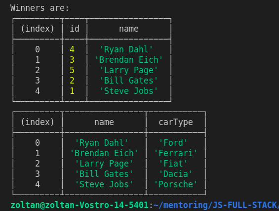
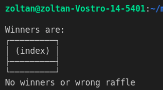
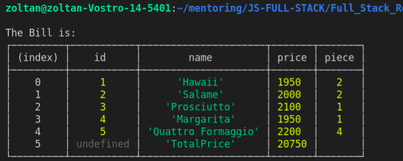

# Pizzarendelő és autó-lottó miniprojekt

Előre megadtunk egy projektstruktúrát a feladathoz.    
A 3 réteg:
- index.js fájl: elképzelhetjük úgy, mint egy **controller**-t vagy userInterface-t, amely meghajtja majd mind a 3 réteget
- service: **szerviz** vagy "business" logic réteg, a kapott paraméterekkel elvégzi a logikai munkát
- integration: **adatbázis vagy repository** réteg, itt most egy-egy lista képviseli az adatbázist. Ez a réteg szokott közvetlenül az adatbázishoz kapcsolódni, és exportálja tovább a lekért adatokat a **service** rétegnek.


**Tippek a feladatokhoz:**
- Használj az aszinkron műveletekhez Promise-t!
- Amikor egy metódussal elkészülsz, importáld be az adott metódust az index.js fájlba és teszteld. Csak akkor menj tovább, ha a részfeladat, az adott metódus megfelelően működik.
- Amikor listát, objektumokat akarsz kilogolni, használd a **console.table()** metódust a szebb megjelenítéshez.
- Ha működik a teljes feladat, refaktorálj! Vegyél ki minden felesleges tesztet, importot stb...
- Játssz a végén a metódusokkal, adj nekik többfajta paramétert. Nézd meg, hogyan futnak párhuzamosan egymás mellett a sorsolás és rendelés projekt metódusai.

**1. Autósorsolás**:

- **Itt az a feladatod, hogy egy teszőlegesen megadott paraméterrel megadhasd, hogy hány ember nyerjen autót**
- **A programnak random kell választania nyerteseket, majd random kell autót is hozzásorsolni az egyes nyertesekhez**
- **Két egyszerű táblázatban kell megjeleníteni a nyerteseket, illetve a nyerteseket az autókkal együtt:**




**Nézzük részletesen a feladatot:**
- Alulról fogunk felfelé építkezni, mint egy háznál.
- A játékosok sorsolása kis időbe telik: => a ```customer.js``` fájlban fejezd be a "chooseRandomCustomers" metódust, amelynek 3 másodperc alatt kell kiválasztania a paraméterben megadott számú nyertest (setTimeout).
- Érvénytelen vagy túl nagy paraméter esetén 0 értéket kell felvennie a paraméternek (nem választ ki senkit).
- Az aszinkronitás kezelését oldd meg úgy, hogy egy Promise-t adsz visszatérési értékként (ezen belül legyen a setTimeout), amely sikeres lefutás esetén visszaadja a nyertesek listáját. Teszteld a müködését az ```index.js``` fájlban!

- A ```car.js``` fájlban készíts egy "chooseRandomCar" metódust, amely visszaad az "adatbázisból" egy random autó objectet. Ez nem tart semennyi plusz ideig. Egy autót csak egyszer lehet kisorsolni! Ki kell kerülnie listából, ha kihúzták.
- Teszteld a mükődését az ```index.js``` fájlban!

- A ```lottery-service```-be importáld be a két metódust az "adatbázis rétegből"!


- A "chooseWinners" metódusnak meg kell hívnia a "chooseRandomCustomers" metódust, átadni neki a paraméterben kapott számot, hogy az adatbázis réteg lekérje a random nyerteseket. Miután sikeresen lezajlott a nyertesek kiválasztása, ki kell logolni a "Winners are:" szöveget, és alá egy táblázatban (console.table()) ki kell logolni a nyertesek adatait.
- A "makeRaffleWithCar" metódusban ellenőrizni kell a paramétert, amely típusának listának kell lennie (nyertesek adatai). Ha nem lista a típusa vagy üres listát kap paraméterként, akkor legyen a visszatérése sima string-ként: "No winners or wrong raffle".

- Egyéb esetben menjen végig a nyertesek listáján, és mindenki nyerjen egy random autót. A sorsolás időbe telik, a művelet legalább 2 másodpercig tart (setTimeout) => Legyen a metódus visszatérési értéke egy Promise, benne a "setTimeout"-tal. Sikeres lefutás esetén adjon vissza egy objektumlistát, amely a nyertesek nevét és a nyert autó típusait sorolja fel. (Nézd meg a fenti képen az alsó táblázatot megint!)

- Teszteld a metódus helyes működését az ```index.js``` fájlban!
- Most össze kell kötni a két metódust. Amikor a "chooseWinners" metódusban kilogoltuk a nyertesek adatait, hívjuk meg a "makeRaffleWithCar" metódust (Promise-t várunk).
- A "chooseWinners" adja vissza a visszatérési értéként a Promise-t ("makeRaffleWithCar").   
  TIPP: mivel be kell várni legalább a "chooseRandomCustomers" lefutását, érdemes async/await-et használni.

- Készen is van az első vezetett feladat. Most menjünk a **"controller"-be**. Az ```index.js``` fájlba importáljuk be a lottery-service-t, és hívjuk meg a "chooseWinners"-t. Logoljuk ki a Promise eredményét. Teszteljük a megoldásunkat többfajta paraméterrel. Hibás paraméter esetén se törjön el az API futása:



**2. Pizzarendelés**

- **Egy pizzát rendelő API-t kell elkészíteni ugyanilyen rétegekben**
- **Listaként kell megadni a pizza Id-ket**
- **Az API elkészítteti a pizzákat, az elkészült számlát visszaküldi (kilogolja):**



**Nézzük részletesen a feladatot:**
- Kezdjük alulról itt is, csak nagyobb önállósággal. Irány az **integration** réteg, a ```pizza.js``` fájl.
- Írd meg a setTimeout és Promise visszatérési értékkel a "bakePizzasById" metódust. Ahány Id-d van a paraméterben, annyi másodperc legyen az időtartam. Ha üres a paraméterlista vagy nem lista a típusa, akkor üres listát adjon vissza a Promise, egyéb esetben az "elkészült" pizzák objektumlistáját. (Lehet most még ismétlődés a listában.) Teszteld a metódusod.


- Jöhet a középső, **service** réteg, az ```order-service``` fájl!   
  Két metódust kell készítened: 'orderPizza' és 'makeBill'.
-  Az 'orderPizza' várja paraméterként a kontrollertől kapott pizzaId-k listáját. Visszatérési értéke az elkészített számla (amelyet a "makeBill" metódus fog elkészíteni). Figyelj arra, ha async metódust használsz, a visszatérési értéke automatikusan Promise lesz.
- Jöjjön a "makeBill" elkészítése. A fizetés gyors művelet: sima szinkron művelet legyen végig. Kapja meg paraméterben a rendeléslistát (elkészült pizzák). Készítsen egy "bill" nevű listát minden megrendelt pizzával: egy pizzanév egyszer szerepelhet, mellette legyen az egységár, illetve egy új "piece" tulajdonság => hogy hány darab pizza volt rendelve a típusból. A lista végén legyen egy "totalPrice" tulajdonság a darabok és egységárak megfelelő szorzatával. Nézd meg a fenti képet még egyszer!
- Törekedj a funkcionális elvek alkalmazására és refaktorálj!

- A **kontrollerben** "hajtsd meg" ezt az alkalmazásodat is, logold ki a rendelés eredményét!
- Játssz kicsit a két feladattal különböző paraméterekkel. Nézd meg, hogyan zajlanak egymás mellett az aszinkron műveletek.

**Sok sikert!**


